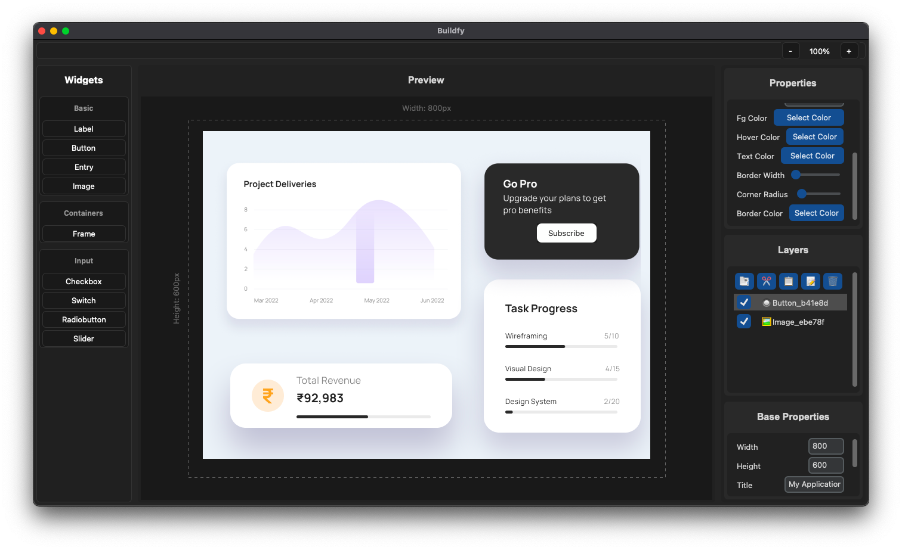

# **Buildfy – The Ultimate CustomTkinter GUI Builder**  

🚀 **Design professional Python GUIs effortlessly with Buildfy!**  
The **Free Version** includes essential tools to kickstart your GUI projects, while the **Pro Version** unlocks advanced features to elevate your designs.  

## **Features**  

### **Free Version (Included in this Repository)**  
- Drag-and-drop interface for essential widgets:  
  - **Labels**, **Buttons**, and **Entry Fields**  
- Real-time preview of your GUI designs  
- Undo/Redo functionality  
- Save and load project support  
- Export to Python files  

### **Pro Version**  
For more advanced features, check out the Pro version on [**Buildfy Pro**](https://buildfygui.netlify.app):  
- Access advanced widgets like **Images**, **Sliders**, and **Checkboxes**  
- Snap-to-grid alignment for precision  
- Dark/Light mode toggle  
- Zoom in/out functionality for detailed designs  
- Export Python files with full compatibility  

## **Supported Widgets**  

### Free Version:  
- Button  
- Label  
- Entry  

### Pro Version (Available on Buildfy Pro):  
- Frame  
- Slider  
- Checkbox  
- Switch  
- Radiobutton  
- Image  

## **How to Use Buildfy (Free Version)**  

1. **Launch the Application**  
   Open the application

2. **Design Your GUI**  
   - Drag and drop widgets (Labels, Buttons, Entry Fields) onto the canvas.  
   - Use the **Properties Panel** to customize widget attributes.  

3. **Preview and Export**  
   - Preview your GUI in real-time.  
   - Save your project or export it as a Python script.  

## **Upgrade to Pro**  
Unlock powerful features with the Pro version!  
👉 [**Explore Buildfy Pro**](https://buildfygui.netlify.app)  

## **Screenshots**  
  

## **License**  
This project is licensed under the MIT License – see the [LICENSE](./LICENSE) file for details.  

## **Feedback and Support**  
We’d love to hear from you! If you encounter any issues or have suggestions, feel free to open an issue or contact us at [support_Proxlight](mailto:proxlight02@gmail.com).  

---

**🌟 Star this repository if you found Buildfy helpful, and visit [Buildfy Pro](https://buildfygui.netlify.app) to unlock your GUI design potential!**  
