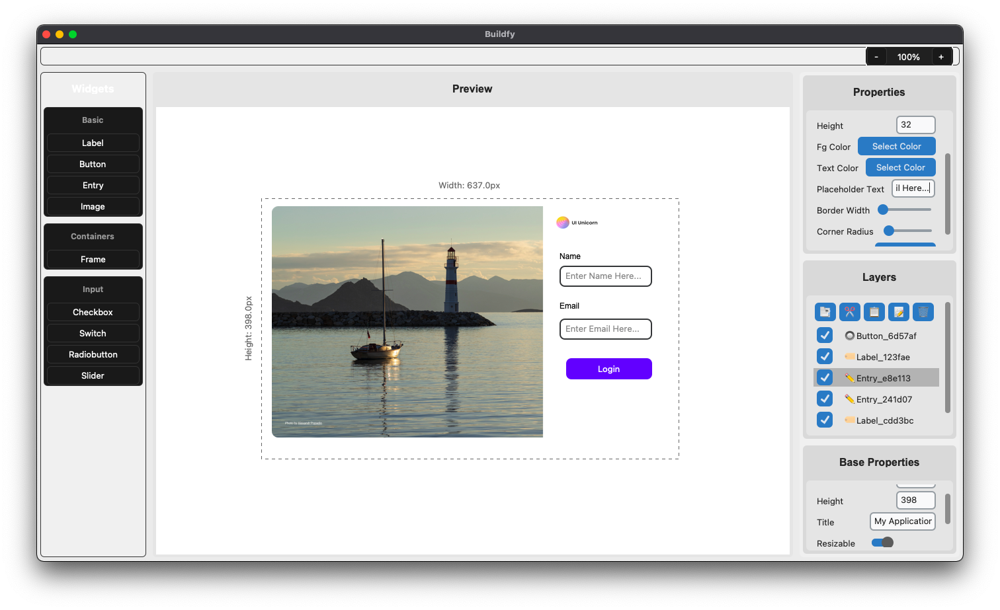

  

# Buildfy – The Ultimate AI-Powered GUI Builder for CustomTkinter

🚀 **Create Beautiful GUIs with AI Assistance and Drag-and-Drop Simplicity**

**Buildfy** is your go-to tool for effortlessly creating **CustomTkinter** interfaces. With **AI-generated** design features, real-time previews, and powerful export options, Buildfy helps you bring your ideas to life without the hassle of manual coding.

  

[Visit our website here!](https://buildfygui.netlify.app/)

---

## New: AI-Generated GUIs Now Available!

**AI-powered designs**: Let **Buildfy** generate your GUI with just a description. Simplify the process and save time with AI’s help.

---

## Features

### Free Version
The Free Version comes packed with all the essentials to get started with GUI design.

- 🎨 **Essential Widgets**: Labels, Buttons, Textboxes, Sliders, and more!
- 🖥️ **Real-Time Preview**: View your design as you make changes.
- 🐍 **Basic Export**: Generate Python code (3 exports/month).
- 🎬 **Startup Screen Widget**: Design splash screens for your applications.

### Pro Version ($8)
Unlock powerful features with the **Pro Version**.

- 🤖 **AI-Generated GUIs**: Let AI generate your interface based on a description.
- 🔄 **Unlimited Exports**: Export as many projects as you need.
- 💾 **Save & Load Projects**: Seamlessly work on multiple designs.
- 🌑🌞 **Dark/Light Mode Toggle**: Design in your preferred theme.
- 🔄 **Lifetime Updates**: Get all future features and widgets.

---

## Screenshots

### Buildfy Interface

### New AI GUI Generation

---

## Download Buildfy

Start building your CustomTkinter GUIs today! [Download Buildfy now](https://buildfygui.netlify.app/).

---

## License

This project is licensed under the **MIT License** – see the [LICENSE file](#) for details.

---

## Feedback & Support

We'd love to hear your thoughts! If you have any issues or suggestions, feel free to open an issue on GitHub or contact us directly at support_Proxlight.

---

🌟 **Star this repository** if you found Buildfy helpful, and unlock your GUI design potential with the **Pro Version**.
